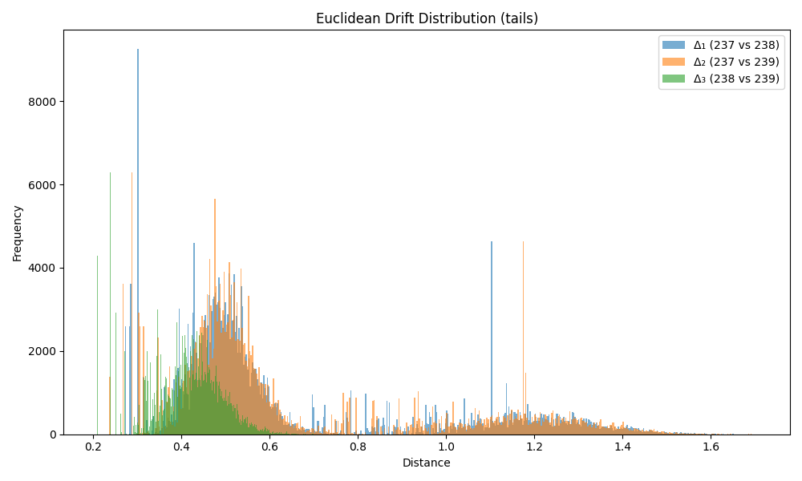
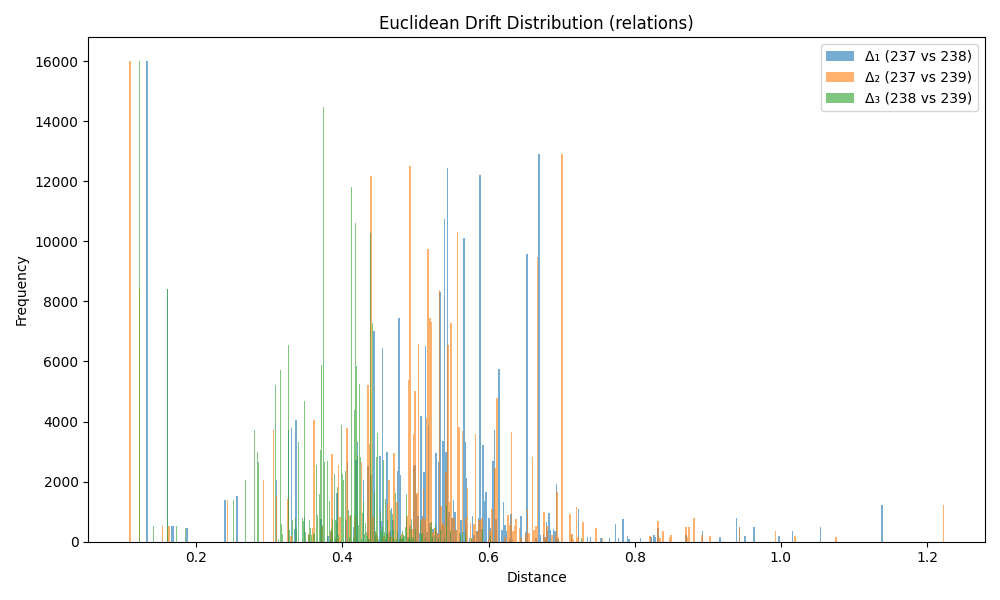
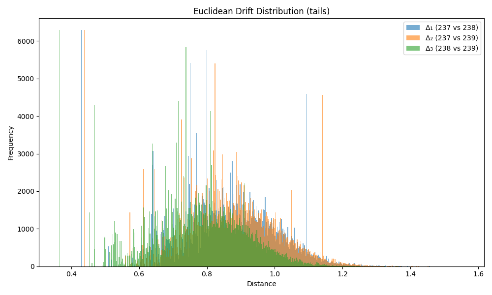
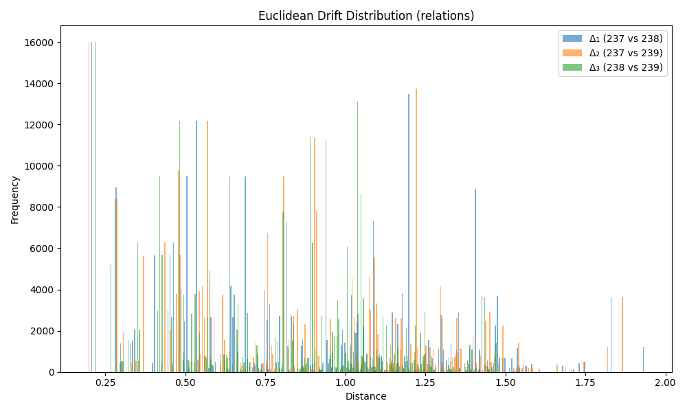

# Comparing KG Embeddings


This folder contains code to measure embedding drift between triples, using TransE with a fixed seed for reproducibility, on the FB15k-237, FB15k-238, and FB15k-239 datasets.

Developed using python version 3.11.11

## Training and Embeddings

### save_drift_data.py
Calls generate_drift_data.py and saves the result to a json/csv file named drift_data.json/csv. The resulting file size is quite large, over 4GB (json) or 1.5GB (csv).

Usage: `python save_drift_data.py [--format <json|csv>] [--filename <output file>] [--epochs <int>]`

### generate_drift_data.py
Contains functions to train on each dataset and returns an object containing each triple which contain embeddings from each dataset `{ triple->dataset->head[], relation[], tail[] }`

The embeddings present in the final result represent triples that exist in all three datasets: T<sub>n</sub> ∈ 237 ∩ 238 ∩ 239

e.g.
```
{
    "triple_string": {
        "dataset_237": {"head": embedding[], "relation": embedding[], "tail": embedding[]},
        "dataset_238": {"head": embedding[], "relation": embedding[], "tail": embedding[]},
        "dataset_239": {"head": embedding[], "relation": embedding[], "tail": embedding[]},
    },
    ...
}
```

Note: the script is pointed to the `../dataset/` directory

## Deterministic Training

### grab_matrices.py
Runs pipeline() on the 237 dataset with num_epochs=0. It then grabs the model and saves to a file. It then does the same thing except with num_epochs set to default. To make pykeen deterministic set random.seed() and torch.manual_seed() to any number.

### compare_matrices.py
This script compares the files outputted by grab_matrices.py and shows which are identical and which are different. The resultant parameters are always the same for any given number of training epochs demonstrating deterministic behavior.

## Calculation and Visualization

### calc_drift.py 
Calculates the average euclidean distance between embeddings of elements of triples shared across the datasets. 

</img>

Usage: `python calc_drift.py [--filepath <path>] [--spo <head|relation|tail>] [--filename <output.png>]`
<br>

### Justifying Number of Training Epochs

To illustrate the effect of training duration on embedding drift, the following plots were generated using **only 5 training epochs**. The head and tail distances appear to show bimodal distributions whereas for 100 epochs the distributions resemble a Gaussian distribution.

<table>
  <tr>
    <th>Heads (5 epochs)</th>
    <th>Tails (5 epochs)</th>
    <th>Relations (5 epochs)</th>
  </tr>
  <tr>
    <td>
      <table>
        <tr><th>Comparison</th><th>Mean Euclidean Drift</th><th>Standard Deviation</th></tr>
        <tr><td><strong>Δ₁ (237 vs 238)</strong></td><td>0.680030</td><td>0.313747</td></tr>
        <tr><td><strong>Δ₂ (237 vs 239)</strong></td><td>0.682184</td><td>0.313614</td></tr>
        <tr><td><strong>Δ₃ (238 vs 239)</strong></td><td>0.439329</td><td>0.064016</td></tr>
      </table>
      <br>
      
    </td>
    <td>
      <table>
        <tr><th>Comparison</th><th>Mean Euclidean Drift</th><th>Standard Deviation</th></tr>
        <tr><td><strong>Δ₁ (237 vs 238)</strong></td><td>0.643354</td><td>0.307334</td></tr>
        <tr><td><strong>Δ₂ (237 vs 239)</strong></td><td>0.646124</td><td>0.309677</td></tr>
        <tr><td><strong>Δ₃ (238 vs 239)</strong></td><td>0.411066</td><td>0.082295</td></tr>
      </table>
      <br>
      
    </td>
    <td>
      <table>
        <tr><th>Comparison</th><th>Mean Euclidean Drift</th><th>Standard Deviation</th></tr>
        <tr><td><strong>Δ₁ (237 vs 238)</strong></td><td>0.501356</td><td>0.161970</td></tr>
        <tr><td><strong>Δ₂ (237 vs 239)</strong></td><td>0.497328</td><td>0.168527</td></tr>
        <tr><td><strong>Δ₃ (238 vs 239)</strong></td><td>0.376040</td><td>0.096940</td></tr>
      </table>
      <br>
      
    </td>
  </tr>
  <tr>
    <th>Heads (100 epochs)</th>
    <th>Tails (100 epochs)</th>
    <th>Relations (100 epochs)</th>
  </tr>
  <tr>
    <td>
      <table>
        <tr><th>Comparison</th><th>Mean Euclidean Drift</th><th>Standard Deviation</th></tr>
        <tr><td><strong>Δ₁ (237 vs 238)</strong></td><td>0.899643</td><td>0.131742</td></tr>
        <tr><td><strong>Δ₂ (237 vs 239)</strong></td><td>0.899607</td><td>0.129738</td></tr>
        <tr><td><strong>Δ₃ (238 vs 239)</strong></td><td>0.814815</td><td>0.130666</td></tr>
      </table>
      <br>
      
    </td>
    <td>
      <table>
        <tr><th>Comparison</th><th>Mean Euclidean Drift</th><th>Standard Deviation</th></tr>
        <tr><td><strong>Δ₁ (237 vs 238)</strong></td><td>0.863759</td><td>0.146335</td></tr>
        <tr><td><strong>Δ₂ (237 vs 239)</strong></td><td>0.865926</td><td>0.146631</td></tr>
        <tr><td><strong>Δ₃ (238 vs 239)</strong></td><td>0.769000</td><td>0.147069</td></tr>
      </table>
      <br>
      
    </td>
    <td>
      <table>
        <tr><th>Comparison</th><th>Mean Euclidean Drift</th><th>Standard Deviation</th></tr>
        <tr><td><strong>Δ₁ (237 vs 238)</strong></td><td>0.865690</td><td>0.402051</td></tr>
        <tr><td><strong>Δ₂ (237 vs 239)</strong></td><td>0.861736</td><td>0.395032</td></tr>
        <tr><td><strong>Δ₃ (238 vs 239)</strong></td><td>0.759481</td><td>0.326970</td></tr>
      </table>
      <br>
      
    </td>
  </tr>
</table>
