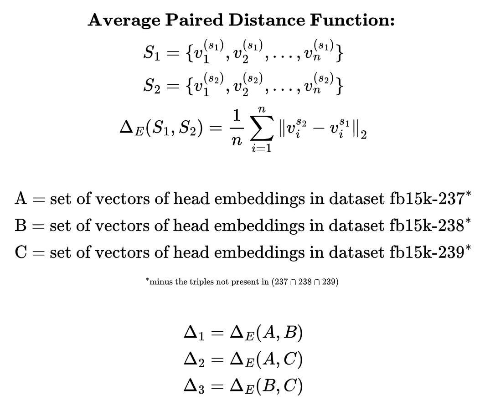
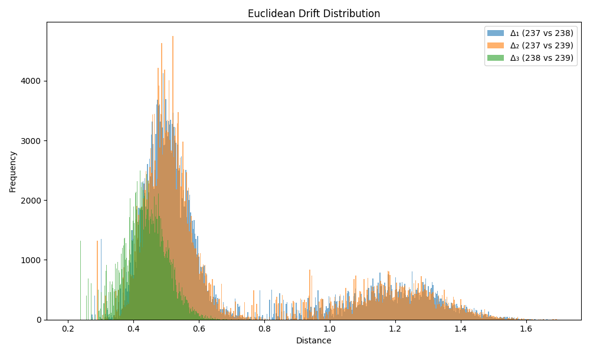
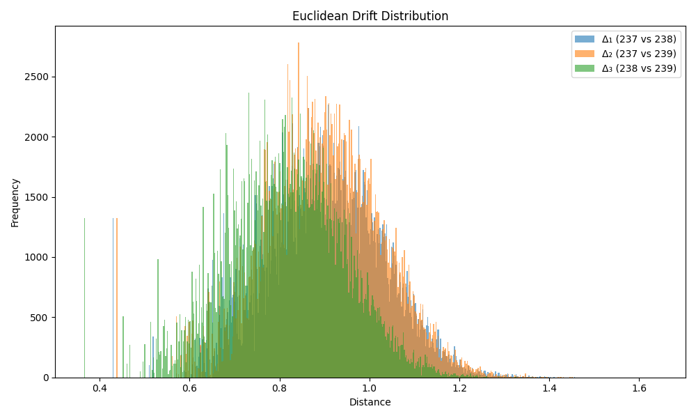

# Comparing KG Embeddings


This folder contains code to measure embedding drift between triples, using TransE with a fixed seed for reproducibility, on the FB15k-237, FB15k-238, and FB15k-239 datasets.

Developed using python version 3.11.11

## Training and Embeddings

### save_drift_data.py
Calls generate_drift_data.py and saves the result to a json/csv file named drift_data.json/csv. The resulting file size is quite large, over 4GB (json) or 1.5GB (csv).

### generate_drift_data.py
Contains functions to train on each dataset and returns an object containing each triple which contain embeddings from each dataset `{ triple->dataset->head[], relation[], tail[] }` epochs set to 100.

The triples present in the final result represent triples that exist in all three datasets: T<sub>n</sub> ∈ 237 ∩ 238 ∩ 239

e.g.
```
{
    "triple_string": {
        "dataset_237": {"head": embedding[], "relation": embedding[], "tail": embedding[]},
        "dataset_238": {"head": embedding[], "relation": embedding[], "tail": embedding[]},
        "dataset_239": {"head": emebedding[], "relation": embedding[], "tail": embedding[]},
    },
    ...
}
```

Note: the script is pointed to the `../dataset/` directory

## Deterministic Training

### grab_matrices.py
Runs pipeline() on the 237 dataset with num_epochs=0. It then grabs the model and saves to a file. It then does the same thing except with num_epochs set to default. To make pykeen deterministic set random.seed() and torch.manual_seed() to any number.

### compare_matrices.py
This script compares the files outputted by grab_matrices.py and shows which are identical and which are different. The resultant parameters are always the same for any given number of training epochs demonstrating deterministic behavior.

## Calculation and Visualization

### calc_drift.py 
Calculates the average euclidean distance between all head entity embeddings in triples shared across datasets. 


</img>


Output for 5 training epochs:

| Comparison         | Mean Euclidean Drift | Standard Deviation  | 
|--------------------|----------------------|---------------------|
| **Δ₁ (237 vs 238)** | 0.680030             | 0.313747           | 
| **Δ₂ (237 vs 239)** | 0.682184             | 0.313614           | 
| **Δ₃ (238 vs 239)** | 0.439329             | 0.064016           |

<br>
</img>
<br><br>
Output for 100 training epochs: <br><br>

| Comparison         | Mean Euclidean Drift | Standard Deviation  | 
|--------------------|----------------------|---------------------|
| **Δ₁ (237 vs 238)** | 0.899643             | 0.131742           | 
| **Δ₂ (237 vs 239)** | 0.899607             | 0.129738           |
| **Δ₃ (238 vs 239)** | 0.814815             | 0.130666           | 

<br>
</img>

