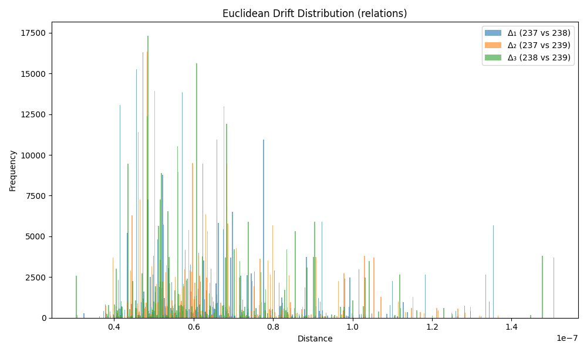

### Drift Summary for `relation`

| Comparison         | Mean Euclidean Drift | Standard Deviation |
|--------------------|----------------------|---------------------|
| **Δ₁ (237 vs 238)** | 0.000000             | 0.000000           |
| **Δ₂ (237 vs 239)** | 0.000000             | 0.000000           |
| **Δ₃ (238 vs 239)** | 0.000000             | 0.000000           |

