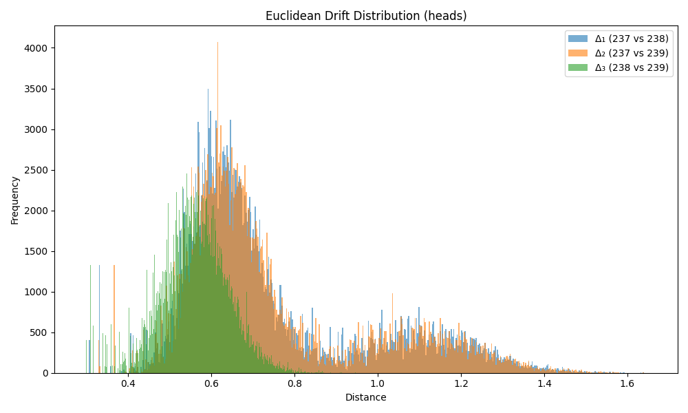

### Drift Summary for `head`

| Comparison         | Mean Euclidean Drift | Standard Deviation |
|--------------------|----------------------|---------------------|
| **Δ₁ (237 vs 238)** | 0.745270             | 0.225862           |
| **Δ₂ (237 vs 239)** | 0.748099             | 0.224192           |
| **Δ₃ (238 vs 239)** | 0.560965             | 0.081191           |

