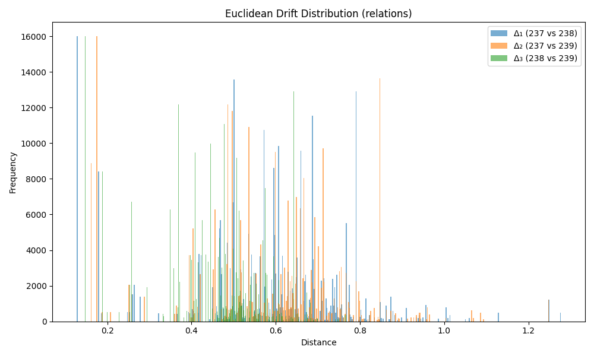

### Drift Summary for `relation`

| Comparison         | Mean Euclidean Drift | Standard Deviation |
|--------------------|----------------------|---------------------|
| **Δ₁ (237 vs 238)** | 0.573533             | 0.192627           |
| **Δ₂ (237 vs 239)** | 0.577169             | 0.191033           |
| **Δ₃ (238 vs 239)** | 0.451789             | 0.130354           |

