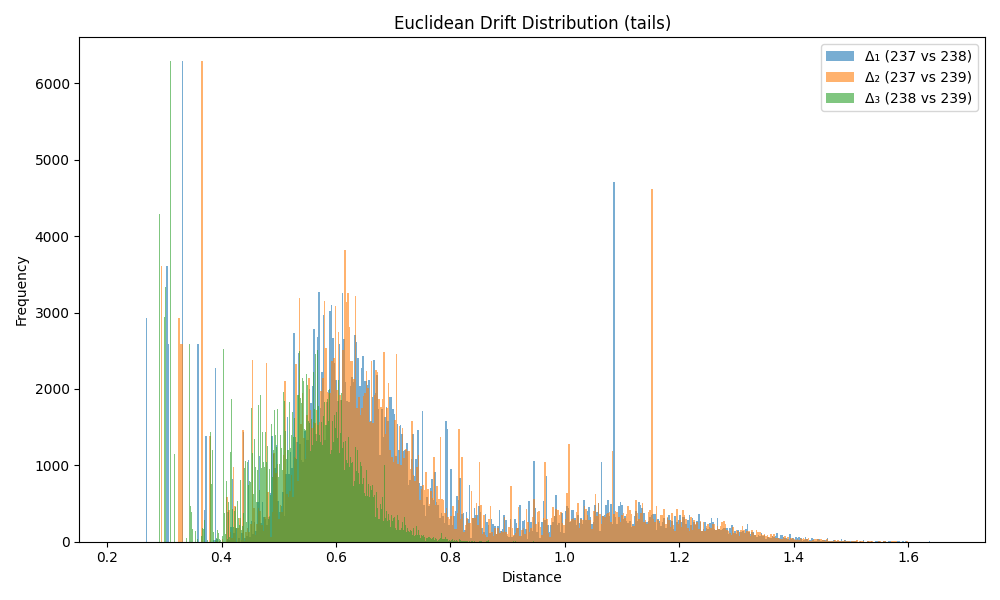

### Drift Summary for `tail`

| Comparison         | Mean Euclidean Drift | Standard Deviation |
|--------------------|----------------------|---------------------|
| **Δ₁ (237 vs 238)** | 0.700869             | 0.238187           |
| **Δ₂ (237 vs 239)** | 0.706011             | 0.237694           |
| **Δ₃ (238 vs 239)** | 0.524151             | 0.107459           |

