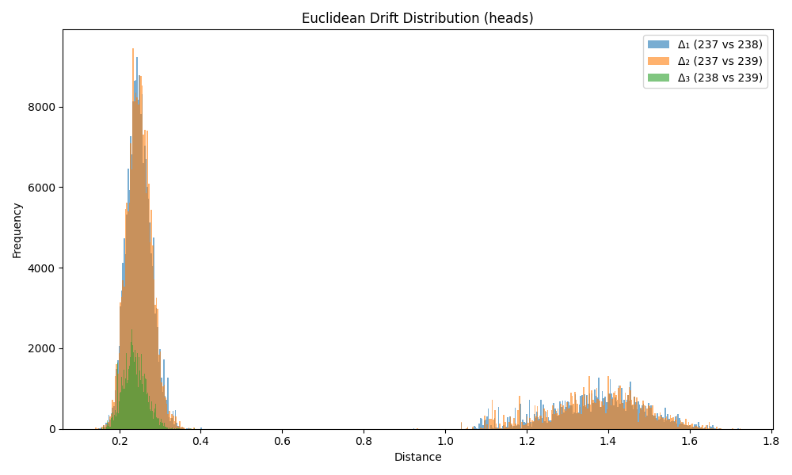

### Drift Summary for `head`

| Comparison         | Mean Euclidean Drift | Standard Deviation |
|--------------------|----------------------|---------------------|
| **Δ₁ (237 vs 238)** | 0.548755             | 0.501207           |
| **Δ₂ (237 vs 239)** | 0.549280             | 0.501335           |
| **Δ₃ (238 vs 239)** | 0.237507             | 0.028535           |

