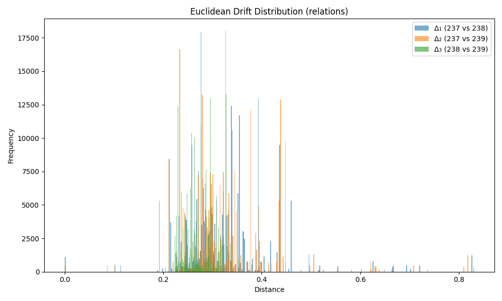

### Drift Summary for `relation`

| Comparison         | Mean Euclidean Drift | Standard Deviation |
|--------------------|----------------------|---------------------|
| **Δ₁ (237 vs 238)** | 0.320820             | 0.084349           |
| **Δ₂ (237 vs 239)** | 0.324562             | 0.085230           |
| **Δ₃ (238 vs 239)** | 0.269317             | 0.036232           |

