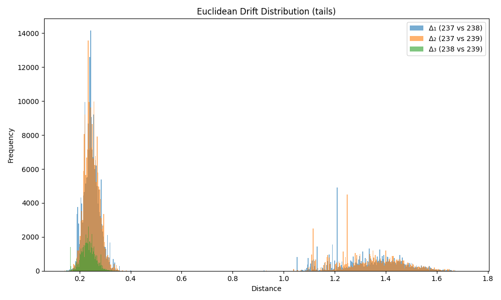

### Drift Summary for `tail`

| Comparison         | Mean Euclidean Drift | Standard Deviation |
|--------------------|----------------------|---------------------|
| **Δ₁ (237 vs 238)** | 0.532410             | 0.483982           |
| **Δ₂ (237 vs 239)** | 0.534347             | 0.484941           |
| **Δ₃ (238 vs 239)** | 0.234872             | 0.028699           |

