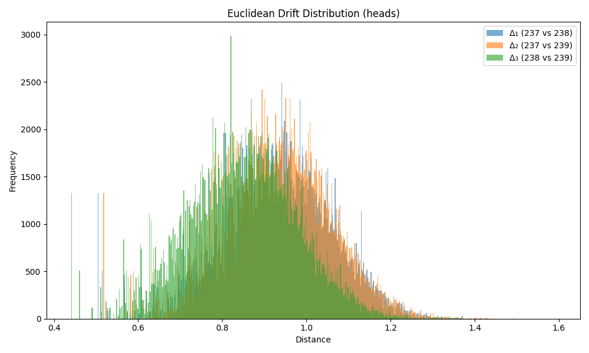

### Drift Summary for `head`

| Comparison         | Mean Euclidean Drift | Standard Deviation |
|--------------------|----------------------|---------------------|
| **Δ₁ (237 vs 238)** | 0.932393             | 0.127591           |
| **Δ₂ (237 vs 239)** | 0.929965             | 0.127397           |
| **Δ₃ (238 vs 239)** | 0.849108             | 0.130508           |

