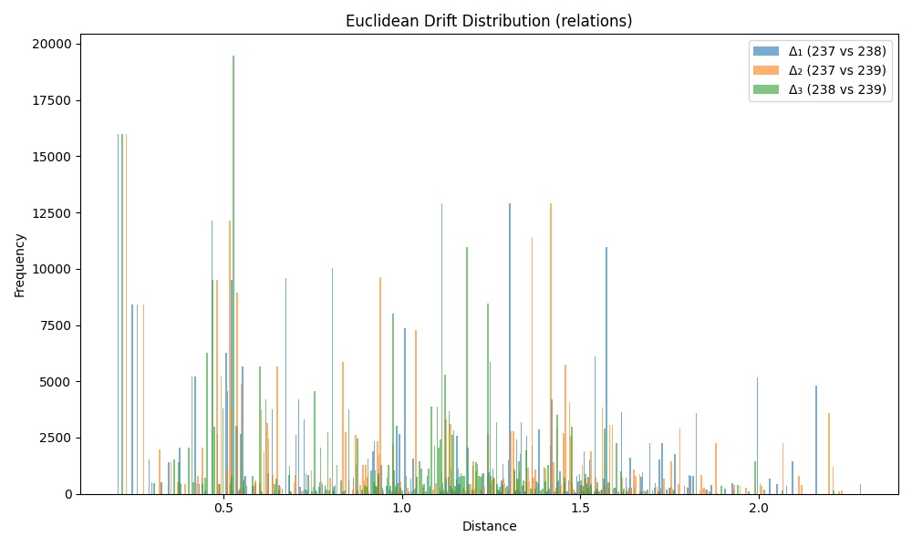

### Drift Summary for `relation`

| Comparison         | Mean Euclidean Drift | Standard Deviation |
|--------------------|----------------------|---------------------|
| **Δ₁ (237 vs 238)** | 1.013992             | 0.530235           |
| **Δ₂ (237 vs 239)** | 1.014604             | 0.507872           |
| **Δ₃ (238 vs 239)** | 0.896226             | 0.413012           |

