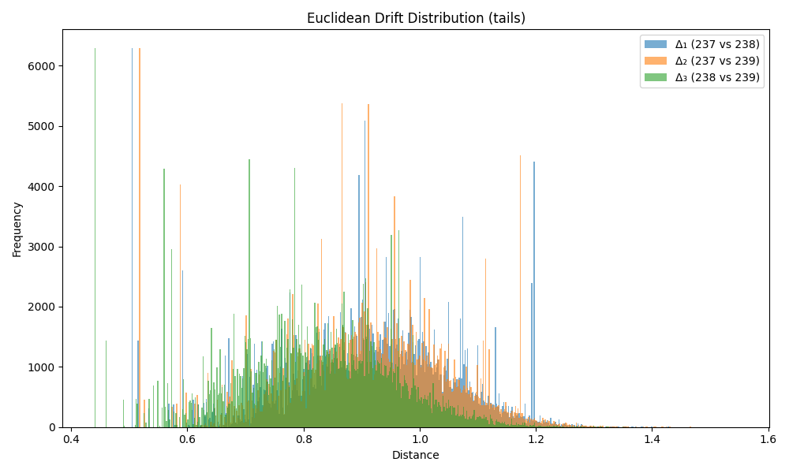

### Drift Summary for `tail`

| Comparison         | Mean Euclidean Drift | Standard Deviation |
|--------------------|----------------------|---------------------|
| **Δ₁ (237 vs 238)** | 0.910897             | 0.151362           |
| **Δ₂ (237 vs 239)** | 0.905163             | 0.146783           |
| **Δ₃ (238 vs 239)** | 0.811965             | 0.144373           |

