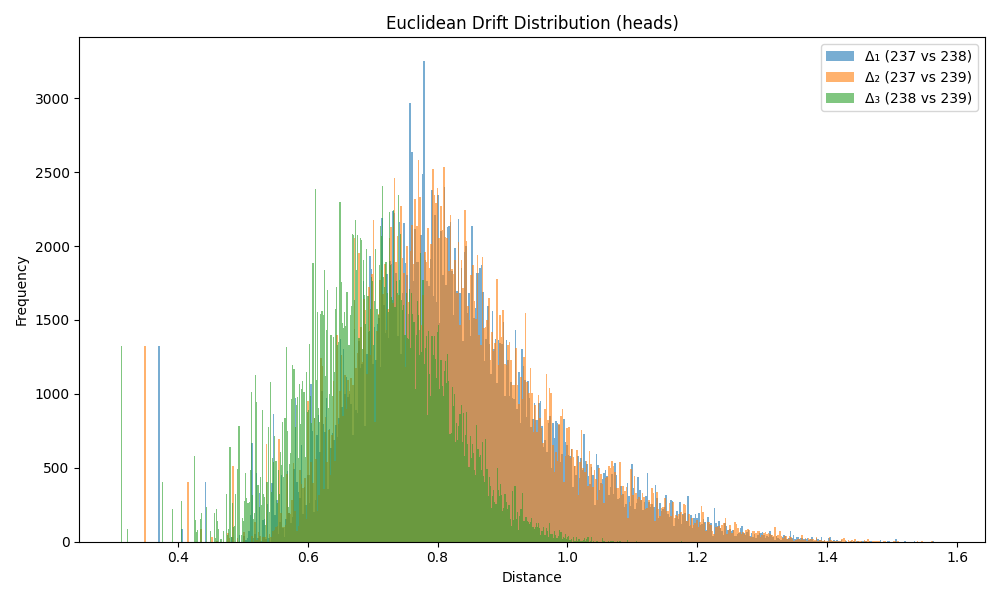

### Drift Summary for `head`

| Comparison         | Mean Euclidean Drift | Standard Deviation |
|--------------------|----------------------|---------------------|
| **Δ₁ (237 vs 238)** | 0.824136             | 0.151941           |
| **Δ₂ (237 vs 239)** | 0.826599             | 0.151162           |
| **Δ₃ (238 vs 239)** | 0.701592             | 0.107184           |

