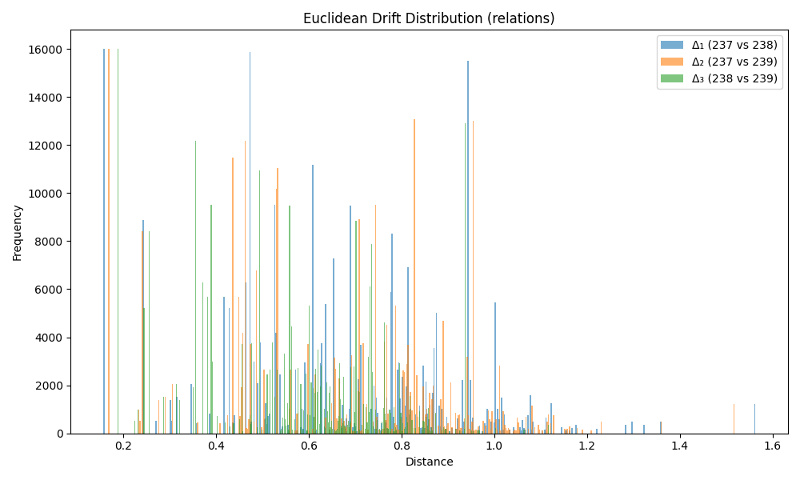

### Drift Summary for `relation`

| Comparison         | Mean Euclidean Drift | Standard Deviation |
|--------------------|----------------------|---------------------|
| **Δ₁ (237 vs 238)** | 0.662607             | 0.249711           |
| **Δ₂ (237 vs 239)** | 0.660335             | 0.248810           |
| **Δ₃ (238 vs 239)** | 0.563823             | 0.198440           |

