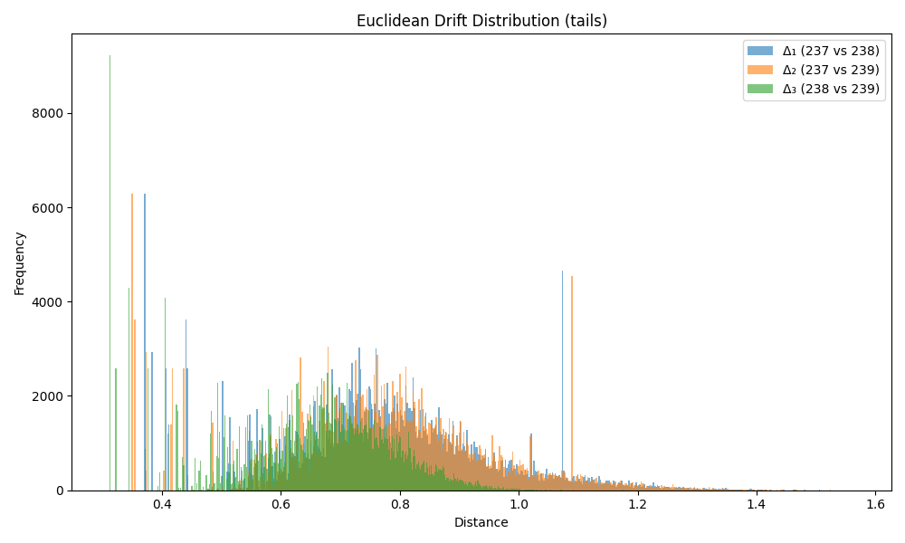

### Drift Summary for `tail`

| Comparison         | Mean Euclidean Drift | Standard Deviation |
|--------------------|----------------------|---------------------|
| **Δ₁ (237 vs 238)** | 0.773495             | 0.182581           |
| **Δ₂ (237 vs 239)** | 0.776617             | 0.185076           |
| **Δ₃ (238 vs 239)** | 0.648503             | 0.143170           |

