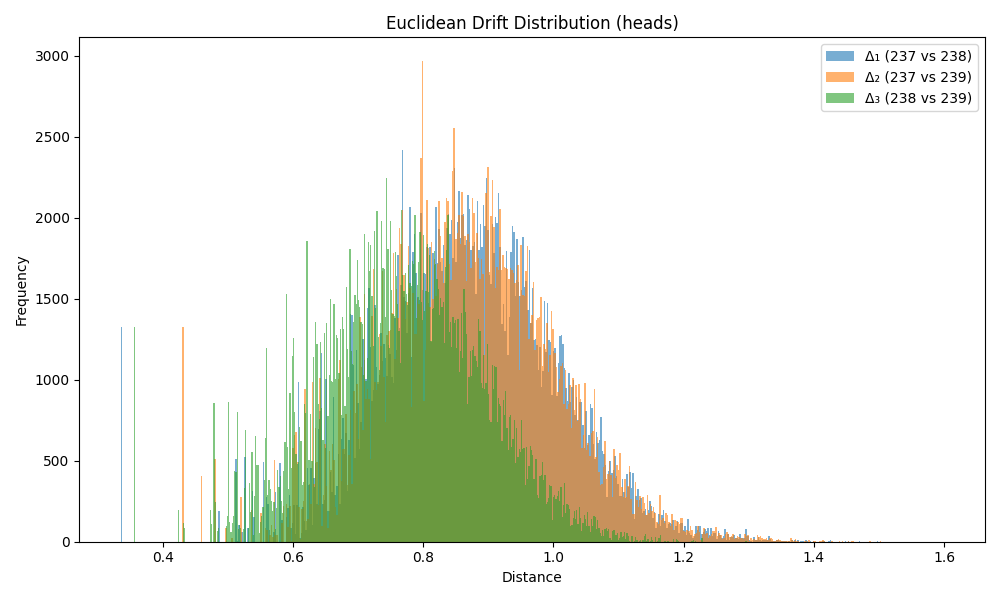

### Drift Summary for `head`

| Comparison         | Mean Euclidean Drift | Standard Deviation |
|--------------------|----------------------|---------------------|
| **Δ₁ (237 vs 238)** | 0.866667             | 0.136976           |
| **Δ₂ (237 vs 239)** | 0.867281             | 0.135929           |
| **Δ₃ (238 vs 239)** | 0.770071             | 0.124259           |

