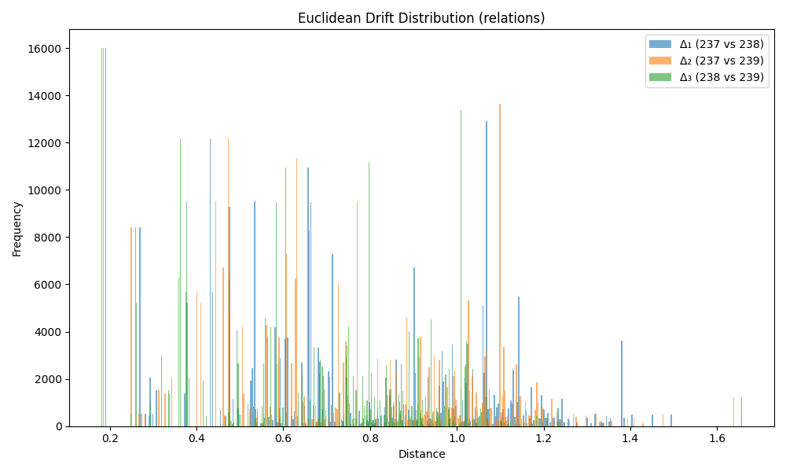

### Drift Summary for `relation`

| Comparison         | Mean Euclidean Drift | Standard Deviation |
|--------------------|----------------------|---------------------|
| **Δ₁ (237 vs 238)** | 0.743669             | 0.313210           |
| **Δ₂ (237 vs 239)** | 0.740452             | 0.312770           |
| **Δ₃ (238 vs 239)** | 0.640996             | 0.256797           |

