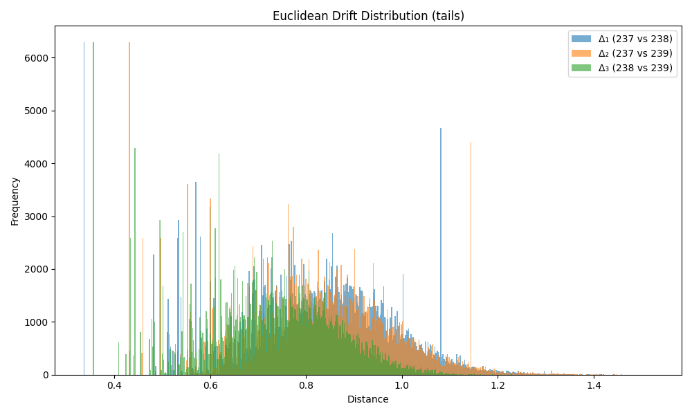

### Drift Summary for `tail`

| Comparison         | Mean Euclidean Drift | Standard Deviation |
|--------------------|----------------------|---------------------|
| **Δ₁ (237 vs 238)** | 0.816908             | 0.168594           |
| **Δ₂ (237 vs 239)** | 0.820152             | 0.166163           |
| **Δ₃ (238 vs 239)** | 0.718567             | 0.145012           |

